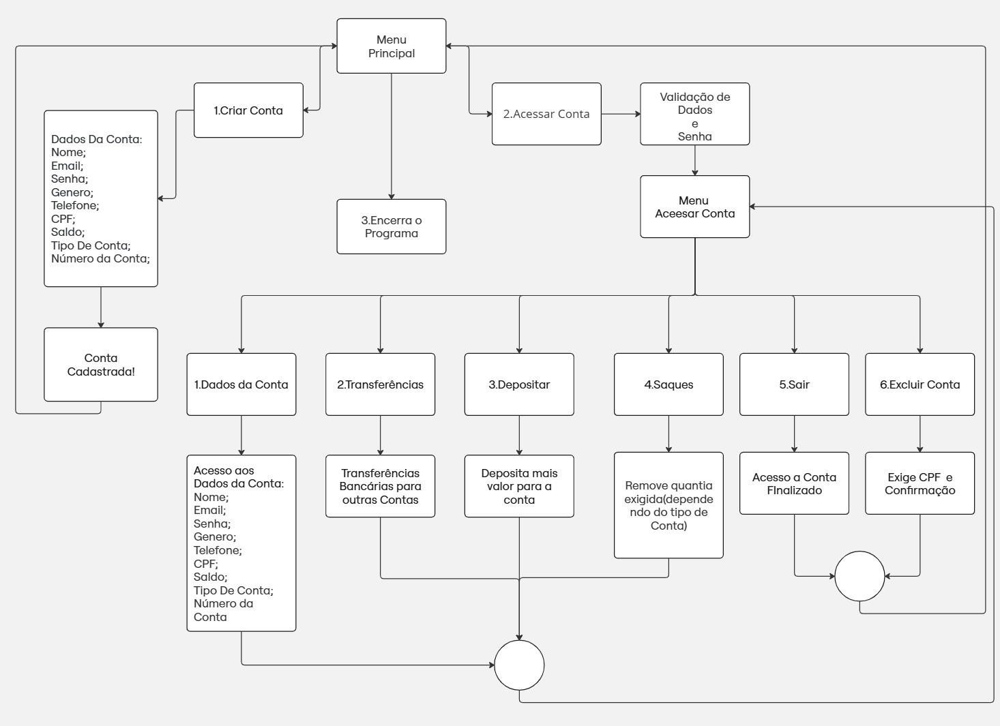

# 🏦 Banking System in C

Collaborative project developed for the **Data Structures** course at UFG.

👥 **Team Members**
- Matheus Teles Marques  
- Victor Alves Freire de Queiroz  
- Yan Santos Leite  

📘 **Instructor:** Prof. Bruna Michelly de Oliveira Silva and Aldo André Díaz Salazar

---

## 💡 Description
A simple **banking system** implemented in the C language, simulating the main functionalities of a modern bank application.  
The system allows users to **create, access, and manage bank accounts**, including deposits, withdrawals, and transfers between accounts.

The project was designed to reinforce concepts of **pointers, dynamic memory, and linked lists**, focusing on efficiency and data integrity.

---

## ⚙️ Features
- Create and delete accounts  
- Authenticate using CPF and password  
- Perform deposits, withdrawals, and transfers  
- Check account balance  
- Manage dynamic data using **linked lists**

---

## 🧠 Key Learnings
- Pointer manipulation and memory management in C  
- Modular programming and separation of concerns  
- Implementation of dynamic data structures (linked lists)  
- Team collaboration and version control practices  

---

## 🧭 System Flowchart

The diagram below illustrates the main flow of the banking system — from account creation to transactions and system exit.



> The flowchart shows the logical steps of the system, including account creation, authentication, deposits, withdrawals, transfers, and account deletion.  
> It was developed collaboratively to plan the program structure before implementation.

---

## 🔧 How to Compile and Run
1. Clone or download the repository:
   ```bash
   git clone https://github.com/matheusmarqs1/banking-system-c.git
   cd banking-system-c
   ```

2. Compile the program:
   ```bash
   gcc main.c -o bank-system
   ```

3. Run the System:

**▶️ On Linux / WSL:**

   ```bash
   ./bank-system
   ```

**💻 On Windows (CMD or PowerShell):**

```bash
   bank-system.exe
   ```

---

## 💻 Technologies
* **Language:** C (ANSI C Standard)
* **Compiler:** GCC (GNU Compiler Collection)
* **Environment:** Linux / Windows

---

## ✉️ Contact
For questions, suggestions, or contact:

* **Authors:** Matheus Teles Marques, Victor Alves Freire de Queiroz, Yan Santos Leite
* **Main Email:** matheusti770@gmail.com